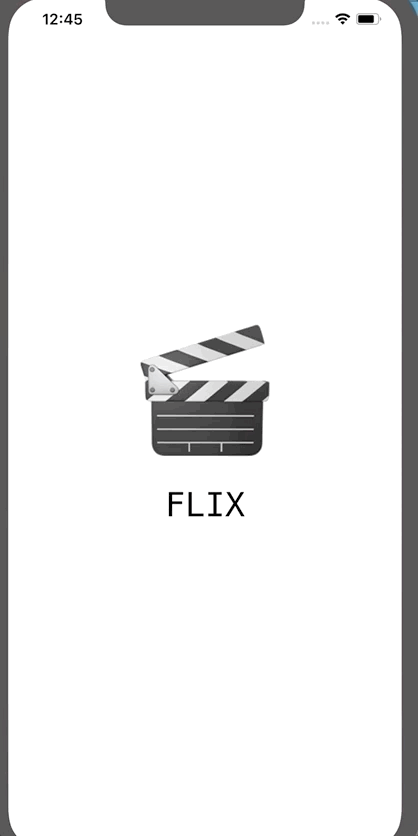

# Flix

Flix is an app that allows users to browse movies from the [The Movie Database API](http://docs.themoviedb.apiary.io/#).

## Flix Part 2

### User Stories

#### REQUIRED (10pts)
- [ ] (5pts) User can tap a cell to see more details about a particular movie.
- [ ] (5pts) User can tap a tab bar button to view a grid layout of Movie Posters using a CollectionView.

#### BONUS
- [ ] (2pts) User can tap a poster in the collection view to see a detail screen of that movie.
- [ ] (2pts) In the detail view, when the user taps the poster, a new screen is presented modally where they can view the trailer.

### App Walkthrough GIF

### Notes
---

## Flix Part 1

### User Stories

#### REQUIRED (10pts)
- [X] (2pts) User sees an app icon on the home screen and a styled launch screen.
- [X] (5pts) User can view and scroll through a list of movies now playing in theaters.
- [X] (3pts) User can view the movie poster image for each movie.

### App Walkthrough GIF
 

### Notes
One challenge I faced when building the app was installing cocoapods. It would crash mid-way and display `ERROR: Failed to build gem native extension.` Per stackoverflow, I had an outdated version of Ruby on my system and so I had to update ruby and delete outdated files. Instead of using sudo to install cocoapods, I used homebrew and it worked :raised_hands:
